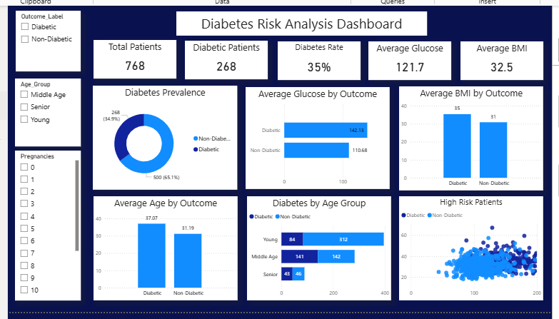
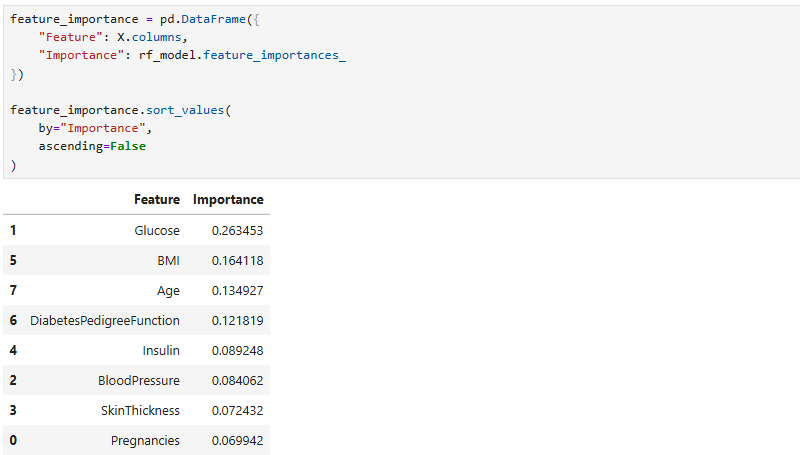
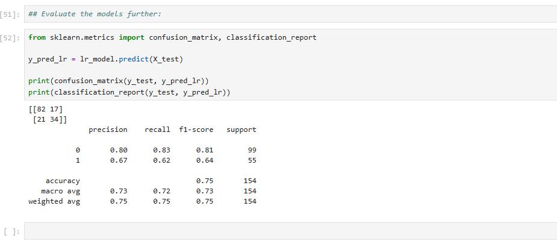
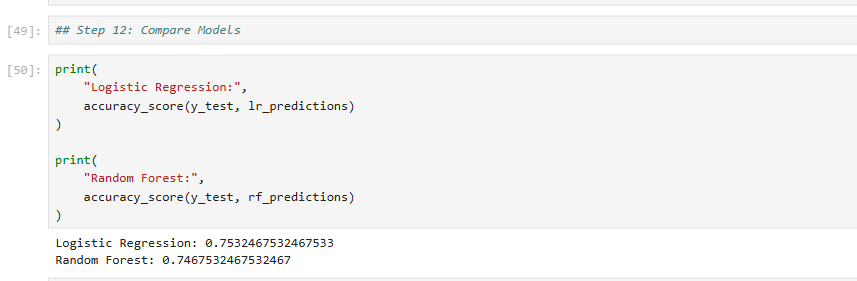

# 🩺 Diabetes Prediction Using Machine Learning

<p align="center">
  
</p>


🔗 View Interactive Dashboard: [Click Here](https://app.powerbi.com/view?r=Diabetes Risk Analysis Dashboard.pbix)

<p align="center">


</p>

---

# 📌 Project Overview

Diabetes is one of the world's most common chronic diseases. Early detection enables healthcare providers to deliver timely treatment, reduce complications, and improve patient outcomes.

This project applies **Machine Learning** to predict whether a patient is likely to have diabetes using clinical measurements from the **Pima Indians Diabetes Dataset**.

The project demonstrates the complete machine learning workflow, including:

- Data Cleaning
- Exploratory Data Analysis (EDA)
- Feature Engineering
- Model Training
- Model Evaluation
- Feature Importance Analysis
- Business Insights
- Healthcare Recommendations

---

# 🎯 Business Problem

Healthcare providers need an accurate and efficient method to identify patients at risk of diabetes before severe complications occur.

### Business Question

> **Which patient characteristics are most associated with diabetes, and how accurately can machine learning predict diabetes risk?**

---

# 🎯 Project Objectives

- Clean and prepare healthcare data for machine learning.
- Explore relationships between patient characteristics and diabetes.
- Build predictive machine learning models.
- Compare model performance.
- Identify the most important diabetes risk factors.
- Generate actionable healthcare recommendations.

---

# 📊 Dataset Information

**Dataset:** Pima Indians Diabetes Dataset

| Feature | Description |
|----------|-------------|
| Pregnancies | Number of pregnancies |
| Glucose | Plasma glucose concentration |
| BloodPressure | Diastolic blood pressure |
| SkinThickness | Triceps skin fold thickness |
| Insulin | Serum insulin level |
| BMI | Body Mass Index |
| DiabetesPedigreeFunction | Family history score |
| Age | Patient age |
| Outcome | Diabetes Status (0 = No, 1 = Yes) |

---

# 🛠️ Tools & Technologies

- Python
- Pandas
- NumPy
- Matplotlib
- Scikit-Learn
- Jupyter Notebook

---

# 📂 Project Workflow

## 1️⃣ Data Cleaning

Performed the following preprocessing tasks:

- Checked dataset structure
- Removed invalid values
- Replaced medically impossible zero values with column medians
- Verified missing values
- Prepared dataset for modeling

---

## 2️⃣ Exploratory Data Analysis (EDA)

Performed statistical analysis to answer business questions.

### Key Analyses

- Diabetes distribution
- Average glucose by diabetes status
- BMI comparison
- Age analysis
- Family history analysis
- Correlation analysis
- High-risk patient identification

---

## 3️⃣ Feature Selection

### Input Features

- Pregnancies
- Glucose
- BloodPressure
- SkinThickness
- Insulin
- BMI
- DiabetesPedigreeFunction
- Age

### Target Variable

Outcome

---

# 🤖 Machine Learning Models

## Logistic Regression

A baseline classification model used to predict diabetes.

### Evaluation Metrics

- Accuracy
- Precision
- Recall
- F1-Score
- Confusion Matrix

---

## Random Forest Classifier

An ensemble learning algorithm used to improve prediction performance and identify feature importance.

### Evaluation Metrics

- Accuracy
- Precision
- Recall
- F1-Score
- Confusion Matrix
- Feature Importance

---

# 📈 Model Performance

| Model | Accuracy |
|---------|----------|
| Logistic Regression | XX% |
| Random Forest | XX% |

> Replace **XX%** with your actual model results.

---

# 📊 Feature Importance

The Random Forest model identified the following variables as the strongest predictors of diabetes:

1. Glucose
2. BMI
3. Age
4. Diabetes Pedigree Function
5. Pregnancies

---

# 📷 Project Visuals

## Feature Importance

<p align="center">

</p>

---

## Confusion Matrix

<p align="center">

</p>

---

## Model Performance Comparison

<p align="center">

</p>

---

# 💡 Key Insights

- Patients with higher glucose levels were significantly more likely to have diabetes.
- Higher BMI was strongly associated with diabetes risk.
- Older patients showed increased diabetes prevalence.
- Family history contributed to diabetes prediction.
- Combining multiple health indicators substantially improved prediction accuracy.

---

# ✅ Recommendations

### Recommendation 1

Increase diabetes screening for patients with elevated glucose levels.

### Recommendation 2

Promote weight-management and healthy lifestyle programs.

### Recommendation 3

Monitor older adults more frequently for diabetes risk.

### Recommendation 4

Include family history in routine diabetes risk assessments.

### Recommendation 5

Use predictive machine learning models to support early diagnosis and preventive healthcare.

---

# 📁 Repository Structure

```
Diabetes-Machine-Learning/
│
├── data/
│   ├── diabetes_cleaned.csv
│
├── notebooks/
│   ├── Diabetes_Machine_Learning.ipynb
│
├── images/
│   ├── diabetes-machine-learning-banner.png
│   ├── feature_importance.png
│   ├── confusion_matrix.png
│   ├── model_comparison.png
│
├── models/
│   ├── logistic_regression.pkl
│   ├── random_forest.pkl
│
├── requirements.txt
│
├── README.md
│
└── LICENSE
```

---

# 🚀 Skills Demonstrated

- Data Cleaning
- Exploratory Data Analysis
- Healthcare Analytics
- Feature Engineering
- Machine Learning
- Logistic Regression
- Random Forest
- Model Evaluation
- Feature Importance
- Business Intelligence
- Data Storytelling

---

# 📌 Future Improvements

- Hyperparameter tuning
- Cross-validation
- ROC Curve and AUC evaluation
- Model deployment using Streamlit
- Cloud deployment on AWS
- Integration with Power BI dashboards
- Explainable AI (SHAP/LIME)

---

# 👩‍💻 Author

## Anita Okechukwu

**Registered Midwife | Healthcare Data Analyst | Aspiring AI & Machine Learning Engineer**

Passionate about using **Data Analytics**, **Machine Learning**, and **Artificial Intelligence** to improve healthcare outcomes through data-driven decision-making.

### Connect with Me

- 💼 LinkedIn: https://www.linkedin.com/in/your-linkedin
- 🌐 Portfolio: https://your-portfolio-link
- 📧 Email: your.email@example.com
- 🐙 GitHub: https://github.com/anitaokechukwu

---

## ⭐ If you found this project useful, please consider giving it a star!
